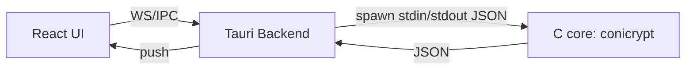
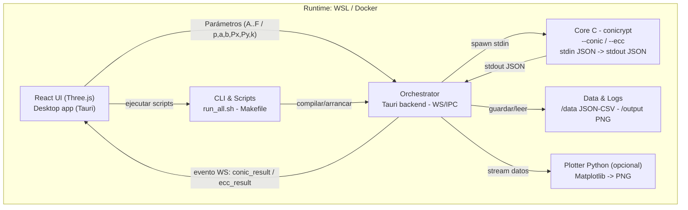

<div align="center">
<pre>
██████╗ ██████╗ ███╗   ██╗██╗ ██████╗██████╗ ██╗   ██╗██████╗ ████████╗     ██╗      █████╗ ██████╗ 
██╔════╝██╔═══██╗████╗  ██║██║██╔════╝██╔══██╗╚██╗ ██╔╝██╔══██╗╚══██╔══╝     ██║     ██╔══██╗██╔══██╗
██║     ██║   ██║██╔██╗ ██║██║██║     ██████╔╝ ╚████╔╝ ██████╔╝   ██║        ██║     ███████║██████╔╝
██║     ██║   ██║██║╚██╗██║██║██║     ██╔══██╗  ╚██╔╝  ██╔═══╝    ██║        ██║     ██╔══██║██╔══██╗
╚██████╗╚██████╔╝██║ ╚████║██║╚██████╗██║  ██║   ██║   ██║        ██║███████╗███████╗██║  ██║██████╔╝
 ╚═════╝ ╚═════╝ ╚═╝  ╚═══╝╚═╝ ╚═════╝╚═╝  ╚═╝   ╚═╝   ╚═╝        ╚═╝╚══════╝╚══════╝╚═╝  ╚═╝╚═════╝ 
</pre>
</div>

---

ConiCrypt Lab es un **laboratorio de escritorio** que conecta **formas cuadráticas y cónicas** con una simulación básica de **curvas elípticas (ECC)**.  
Núcleo en **C** (I/O JSON), interfaz **React + Three.js** empaquetada con **Tauri** y comunicación **en tiempo real** via **WebSocket/IPC**.  
Incluye **Bash** para automatización y **Python** para ploteo opcional. Entorno reproducible en **WSL/Docker**.

---

##  Tech Stack

### Lenguajes de programación
<p align="center">
  
  
  
  
  
</p>

### Entorno, herramientas y empaquetado
<p align="center">
  
  
  
  
  
</p>

### Frameworks y librerías
<p align="center">
  
  
  
  
  
  
</p>

---
## 🏛️ Estructura del Proyecto

```
conicrypt-lab/
├── Core/                       # Motor matemático (C)
│   ├── src/
│   │   ├── main.c              # I/O JSON 
│   │   ├── conics.c/.h         # Δ=B^2−4AC, tipo, muestreo simple
│   │   ├── ecc.c/.h            # inv_mod, add, double,
│   │   └── utils.c/.h          # gcd, pow_mod, 
│   ├── bin/                    # ejecutable conicrypt
│   └── Makefile
├── App/                        # Desktop: Tauri (backend) + React/Three.js (UI)
│   ├── src/                    # UI
│   │   ├── main.tsx, App.tsx
│   │   ├── pages/{Home,Conics,ECC}Page.tsx
│   │   ├── components/
│   │   │   ├── layout/{Header,Sidebar,Footer}.tsx
│   │   │   ├── controls/{ConicControls,ECCControls}.tsx
│   │   │   └── visualization/{SceneCanvas,AxesGrid,ConicView,ECCView}.tsx
│   │   ├── lib/{socket.ts,conics.ts,ecc.ts}
│   │   ├── state/{useAppStore.ts,useConicStore.ts,useECCStore.ts}
│   │   └── styles/{globals.css,theme.css}
│   └── src-tauri/              # Backend Tauri (Rust)
│       ├── main.rs             # WS local (p.ej. ws://127.0.0.1:9191)
│       ├── ws.rs               # routing WS
│       └── process.rs          # spawn de core/bin/conicrypt
├── Python/                     # Ploteo opcional
│   ├── plot_conics.py
│   ├── plot_ecc.py
│   └── requirements.txt
├── Scripts/                    # Automatización
│   ├── run_all.sh              # build core + lanzar app 
│   ├── build_all.sh            # empaquetado
│   └── clean.sh
├── Data/                       # JSON/CSV
├── Docs/
└── Docker
    └──  docker-compose.yml     # orquestar
```

---

##  Módulos

| Módulo | Descripción | Tech |
|---|---|---|
| **Core C** | Clasificación de cónicas (Δ) y ECC (mod p). I/O JSON. | C11, Make |
| **Tauri Backend** | WS/IPC local; ejecuta el binario C y reenvía resultados. | Rust, tokio |
| **Dashboard (React)** | UI con Three.js; controla parámetros y renderiza en vivo. | React, R3F, Vite, TS |
| **Plotter (Python)** | Exporta PNG desde JSON (opcional). | Python, Matplotlib |
| **Scripts** | `run_all.sh`, `clean.sh`, `build_all.sh`. | Bash |
| **Docker/WSL** | Entorno reproducible de desarrollo y demo. | Docker, WSL |

---

## 🔁 Orquestación WS/IPC

**Flujo corto:** UI → Tauri WS → `conicrypt` (C) → JSON → Tauri → UI (render).



**Flujo general del sistema:**



**Diagrama PNG (opcional):**  
`Docs/ConiCryptLab_Arquitectura.png`

---

##  Puesta en marcha

**Requisitos**
- WSL2 (Ubuntu) o Linux nativo
- gcc/clang + make
- Node 18+, npm/pnpm
- Rust + `tauri-cli`
- Python 3.10+ (opcional)
- Docker (opcional)

**Instalación rápida**
```bash
# 1) Núcleo C
make -C core

# 2) App de escritorio
cd app
npm install
npm run tauri dev
```

**Docker (opcional)**
```bash
docker compose up --build
```

---

##  WebSocket & IPC (Tauri y backend)

| Componente           | Funcionalidad                                                                 |
|----------------------|-------------------------------------------------------------------------------|
| **Servidor WS/IPC**  | Canal bidireccional UI↔backend. Recibe parámetros y envía resultados en vivo. |
| **Proceso C (spawn)**| Ejecuta `core/bin/conicrypt` (`--conic` / `--ecc`), stdin JSON → stdout JSON. |
| **Errores/Timeout**  | Validación de payload, tiempo máximo de proceso, `{"error":"..."}` a la UI.   |
| **Persistencia**     | Guarda/lee JSON/CSV y PNG en `/data` y `/output`.                             |
| **Configuración**    | Parámetros expuestos (muestreo, límites de p, etc.).                          |

---


---

##  Calidad y estilo
- C: Doxygen
- Python: Sphinx
- TypeScript estricto + ESLint/Prettier  
- Commits con prefijos [FEATURE] [FIX] [IMP]

---

##  Roadmap
- Marching squares y muestreo adaptativo  
- Exportación SVG desde Three.js  
---
